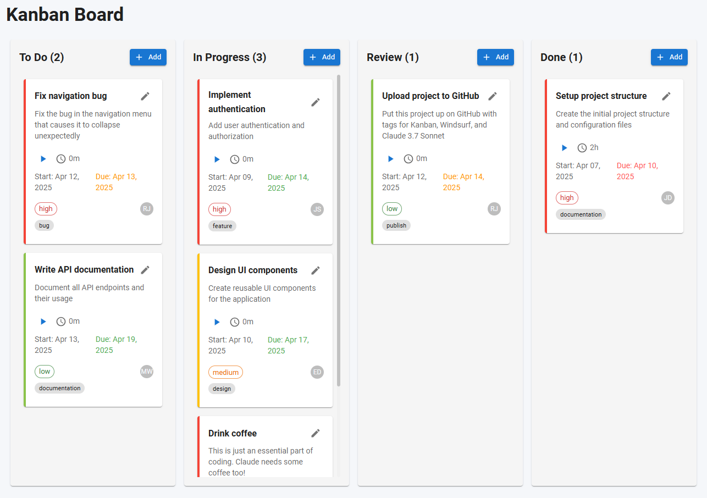

# Kanban Board Demo App

This is a demo Kanban board application built with React, FastAPI, and SQLAlchemy.  It is an example of a full-stack application that uses a database, a backend, and a frontend coded entirely in the [Windsurf IDE](https://www.windsurf.com) using Cascade and [Claude 3.7 Sonnet](https://claude.ai) (but with some guidance from me 😁).  In all, I spent about 4 hours "vibe coding" this app, where 3 of those hours were spent debugging.  Overall, I'm impressed with Claude's ability to handle this level of complexity.  And Windsurf's Cascade is a game-changer! 🤓

## How it was built

I started out creating a self-contained Kanban React-based webapp with no backend.  

```
Create a Kanban app using React.  Each Task card should contain the usual start/end date, status, priority, tagging, comments, and a time tracker.
```

There were a few issues with the app that needed addressing, such as drag-and-drop functionality not working and the time tracker only partially working.  In three or four prompts, Claude fixed those issues.

Then I asked Claude to add an "Assign to" dropdown to the Task card.

```
Add an "Assign to" field in the Task card where a user can be selected from a dropdown.
```
The assign to feature was a one-shot and worked the first time.

I decided to level-up this app and asked for a backend using FastAPI and SQLite.
```
Create a Python and FastAPI backend for this Kanban app.  Use SQLite for the backing database.  The React app will need to be modified to work with the backend server.
```

Initially, it looked pretty good but much of the functionality was not working.  

> _At this code size and complexity level, I felt like Claude may be reaching its context limits (ie. "forgetting" and multi-shot fixes).  Also, maybe unrelated to project size, I don't know, but responses from Claude would occasionally timeout.  Prompting "continue" would always put it back to work._ 🤷‍♂️

Most of the API server functionality was implemented correctly, but many of the React app features still needed to be modified to work with the backend server.  It was clear that I would be providing a lot of debug support. 😬  By debug support, I mean, I'm either describing the issues to Claude and/or copy-pasting errors from the terminal and browser.

After 3 hours of test/debug back-and-forth with Claude, this is the end product.  It's not perfect, but it looks nice and it works. 👍

## Screenshot



## If you wish to try it out

### Prerequisites 

1. Python 3.12.10
2. Node.js 22.14.0
3. npm 11.3.0
4. uv 0.6.14 (uv is a Python project and package manager. [More info here.](https://docs.astral.sh/uv/))

### Instructions

1. Clone this repository
2. From the kanban-api directory, run `uv run main.py`
3. From the kanban-app directory, run `npm start`

**Note:** I'm pretty good with Python, but an absolute novice with Node.js.  So, I'm assuming that npm will handle all the dependencies for you.  Also, worth mentioning, Claude had to use flag `--legacy-peer-deps` when running `npm install` for several packages.

